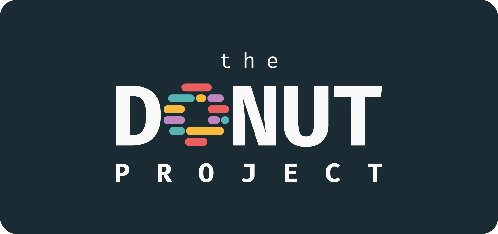

## What is The Donut Project?

This all started with [donut.c](https://www.a1k0n.net/2006/09/15/obfuscated-c-donut.html), the classic C code that looks like, and generates a 3D spinning donut when run. Out of sheer curiosity, I searched up this code in different languages, and noticed that many people have created 3D spinning donuts in those languages... but their code mostly didn't look like a donut.

My goal at the start was to bring this classic piece of code (and its donut shape) to different languages. I started with a [JavaScript rendition of donut.c](https://github.com/EvanZhouDev/donut-js). Then, after much struggle, I created a [Python version](https://github.com/EvanZhouDev/donut-py).

Because I thought it would be fun, I posted both of these projects on YouTube, and to my surprise, it caught on quickly, [getting around 90k views in 2 weeks—and counting](https://www.youtube.com/watch?v=tzpfyTFvU6M). People started asking me to make this in different languages. And now I'm asking _you_.

The Donut Project seeks to replicate donut.c in as many languages as possible, and it's really quite easy to join...

## How do I contribute?

You can either...
* [Contribute your own donut](#contribute-your-own-donut)
* [Contribute someone else's donut](#contribute-someone-elses-donut)

### Contribute Your own Donut

Do so in 2 easy steps:

#### Step 1: Bake Your Donut

First, find a language that someone hasn't done yet (you can see the finished languages in the `donuts` folder or `info.json`) and recreate donut.c!

##### Basic Rules
* Make sure that the output is similar to the original donut.c.
* Also, importantly, make sure that the code looks like a donut.

##### Recommendations
Additionally, here are some (decently strong) recommendations about how you should make your donut:

* Make sure the donut is mostly code. It's alright if there are a few lines/places with comments, however.

#### Step 2: Submit Your Donut

Now, fork this repo with the following command.

```bash
git clone https://github.com/EvanZhouDev/TheDonutProject.git
```

Add your donut to the `donuts` folder. Ensure it is named `donut`, with the proper extension at the end. For example, I may have the file `donut.py` or `donut.js`.

Then, add an entry into `info.json`. The key should be whatever file extension you are using (make sure it matches with your file), and the value should look like this:
* `name` (Your name, or name you would like to associate your donut with)
* `github` (Your github account, *optional*)
* `repo` (Full link to your GitHub repository where you have your donut, *optional*)

For example, my `donut.js` would look something like this:

```json
{
    "name": "Evan Zhou",
    "github": "EvanZhouDev",
    "repo": "https://github.com/EvanZhouDev/donut-js"
}
```

Finally, simply submit a PR (with the language you are contributing in the title), and go through the checklist to complete your submission.

### Contribute Someone Else's Donut

Alternatively, you can also submit donuts that you have found floating around the community already. Ensure that it still follows the [basic rules](#basic-rules) and [recommendations](#recommendations).

Submit it just the same [as above](#step-2-submit-your-donut), but make sure you put *their name* and *their GitHub and repo* if applicable in the `info.json`.
